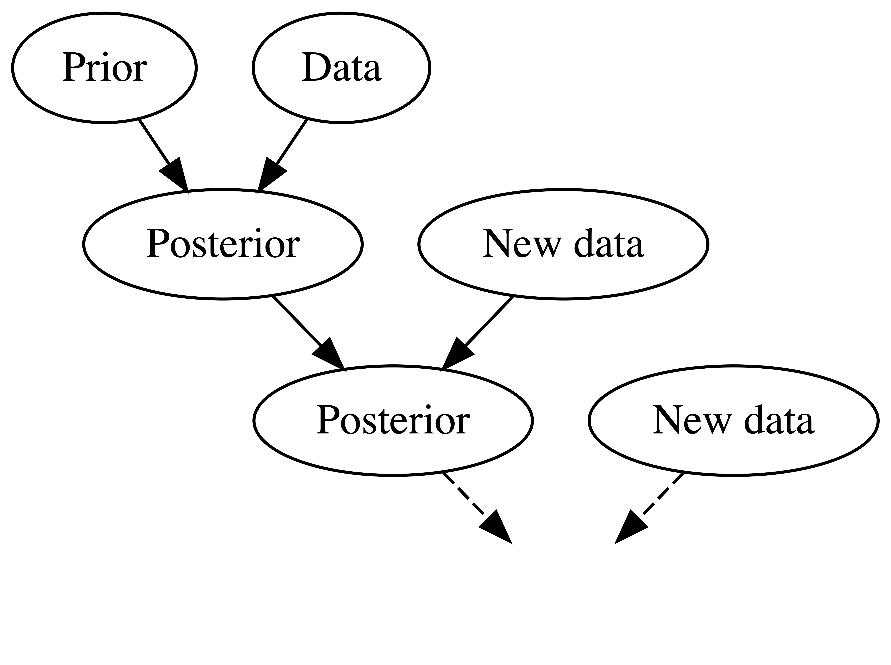

# Lecture 1: Frequentist and Bayseian Overview

## Review of Frquentist Statistical Inference

Recall [DSCI 552: Statistical Interference I](https://mds.farrandi.com/block_2/552_stat_inter/552_stat_inter) and [Distribution Cheatsheet](https://pages.github.ubc.ca/MDS-2023-24/DSCI_553_stat-inf-2_students/notes/appendix-dist-cheatsheet.html)

- Use **Observed Data** (from random sample) to make **Inferences** about **Population Parameters**
  - e.g. $\mu$, $\sigma^2$, median, etc.
  - Find **Point Estimates** and **Confidence Intervals** for these parameters.
- **Latent Population vs. Observable Variables**
  - **Latent Population** is the population that we are interested in, but we can't observe it directly.
  - **Observable Variables** are the variables that we can observe directly.
  - e.g. Online ad click data to estimate the total lifetime revenue.

## Introduction to Bayesian Statistics

- Very flexible
  - Can handle: missing data, complex models, non-iid, etc.
- Valid inference for any (finite) amount of data
- The population parameters are treated as **random variables**
  - Easy to interpret uncertainty of the population parameters

---

$$\text{Posterier} \propto \text{Likelihood} \times \text{Prior}$$

- **Prior**: What we know about the parameter before we see the data (prior knowledge)
- **Likelihood**: How the data is generated given the parameter
- **Posterior**: What we know about the parameter after we see the data.
  - Good for _prediction, inference, and decision making_.

---

- **Recursive Updating**: As we get more data, we can update our prior to get a new posterior.

### Generative Models

- A simplified mathematical model for some reality (For both Frequentist and Bayesian)
- **Generative** because it can make synthetic data
- Examples:
  1. We can incorporate **noise in measurements** (e.g., outputs coming from the
     model).
  2. They can be **overly simplified models with incomplete measurements** (e.g., rainy day model).
  3. They can even incorporate **unobservable latent variables** (e.g., hypothetical tennis rankings).

#### Monte Carlo Simulation

- write stuff

### `Stan` and `rstan` Basics

#### General Steps for Bayesian Modeling

1. Code the generative model in `Stan`
2. Specify observed values of data to estimate using `rstan`
3. Generate synthetic data from the model
4. Perform inference on the synthetic data
   - only data generated from the model is used for inference

_Note_: Generative model is all you need (and get).

### Likelihood Vs Probability

| Likelihood                                                                 | Probability                                                                       |
| -------------------------------------------------------------------------- | --------------------------------------------------------------------------------- |
| how plausible a given distributional parameter is given some observed data | chance that some outcome of interest will happen for a particular random variable |
| $P(\theta \| X = x)$                                                       | $P(X = x \| \theta)$                                                              |
| bounded to 0 and 1                                                         | unbounded to 0 and 1                                                              |
