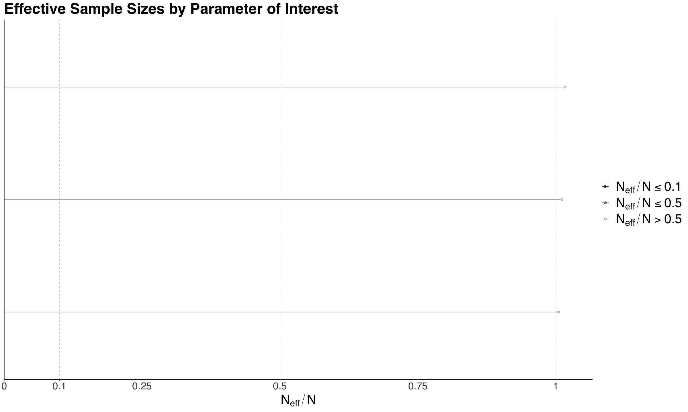

# Lecture 8: More Heirarchical Models and MCMC Diagnostics

## MCMC Diagnostics

- Common pitfalls of MCMC:
  - Not enough iterations
  - Not enough thinning
    - To make it semi-independent
  - Not enough burn-in
- Diagnostic to check if MCMC work and is giving "good" samples for the approx posterior dist

### Trace Plots

- Illustrate posterior sampling by a chain.
- All chains are overlaid on top of each other (without warm-up)
- Ideal:
  - No trend
  - No chain stuck in a local mode

```r
library(bayesplot)

traceplot <- mcmc_trace(mcmc_object,
                        pars = c("param1", "param2"),
                        size = 0.1,
                        facet_args = list(nrow = 3))
```


_Good example of no trend and no chain stuck in a local mode_

### Emperical Density Plots

- Overlays the density plot of the parameter of interest with the MCMC posterior samples.

```r
library(bayesplot)

densityplot <- mcmc_dens_overlay(mcmc_object,
                         pars = c("param1", "param2"),
                         facet_args = list(nrow = 3))
```


### Effective Sample Size (ESS)

- $N_{eff}$: Number of **independent** samples needed to give an accurate MCMC posterior approximation.
- Let $N$ be the length of the chain, then we expect:

  - $N_{eff} \leq N$ is normal and expected
  - $N_{eff} \approx N$ is ideal

- Compare with ratio of $N_{eff}/N$:
  - If $N_{eff}/N > 1$, Means need **more** samples to be as good as Monte Carlo simulation
    - Can increase iter OR increase thinning
  - If $N_{eff}/N < 1$, Means need **less** samples to be as good as Monte Carlo simulation
    - Can decrease iter OR decrease thinning

```r
library(bayesplot)

eff_sample_size <- neff_ratio(mcmc_object,
                    pars = c("param1", "param2"))

essplot <- mcmc_neff(eff_sample_size, size = 2)
```



### Autocorrelation Plots

- MCMC is not entirely independent, so we need to check the autocorrelation of the chain

```r
library(bayesplot)

acf <- mcmc_acf(mcmc_object,
                pars = c("param1", "param2"))
```


### Gelman-Rubin Diagnostic

- Evaluate within-chain and between-chain variance to check if they are roughly the same
- warning: Sometimes does not make sense for discrete variables

$$ \hat{R} = \sqrt{ 1 + \frac{b^2}{s^2} } \approx 1 $$

- $b^2$: Between-chain variance
- $s^2$: Within-chain variance

```r
library(bayesplot)

gelman_rubin <- mcmc_rhat(mcmc_object, size = 2)
```


