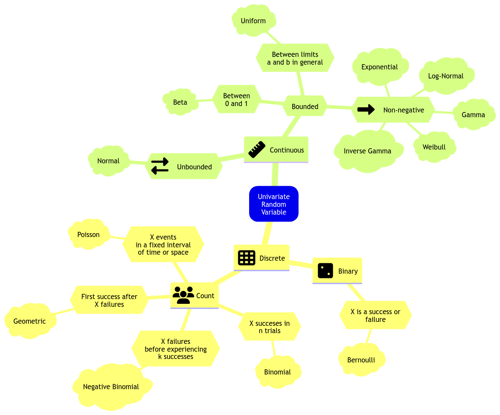

# 552 Quiz 1



## Review of Frquentist Statistical Inference

- Use **Observed Data** (from random sample) to make **Inferences** about **Population Parameters**
  - e.g. $\mu$, $\sigma^2$, median, etc.
  - Find **Point Estimates** and **Confidence Intervals** for these parameters.
- **Latent Population vs. Observable Variables**
  - **Latent Population** is the population that we are interested in, but we can't observe it directly.
  - **Observable Variables** are the variables that we can observe directly.
  - e.g. Online ad click data to estimate the total lifetime revenue.

## Introduction to Bayesian Statistics

- Very flexible
  - Can handle: missing data, complex models, non-iid, etc.
- Valid inference for any (finite) amount of data
- The population parameters are treated as **random variables**
  - Easy to interpret uncertainty of the population parameters

---

$$\text{Posterier} \propto \text{Likelihood} \times \text{Prior}$$

- **Prior**: What we know about the parameter before we see the data (prior knowledge)
- **Likelihood**: How the data is generated given the parameter
- **Posterior**: What we know about the parameter after we see the data.
  - Good for _prediction, inference, and decision making_.

---

- **Recursive Updating**: As we get more data, we can update our prior to get a new posterior.

### Generative Models

- A simplified mathematical model for some reality (For both Frequentist and Bayesian)
- **Generative** because it can make synthetic data
- Examples:
  1. We can incorporate **noise in measurements** (e.g., outputs coming from the
     model).
  2. They can be **overly simplified models with incomplete measurements** (e.g., rainy day model).
  3. They can even incorporate **unobservable latent variables** (e.g., hypothetical tennis rankings).

### `Stan` and `rstan` Basics

- `Stan` is a probabilistic programming language for Bayesian inference
- `rstan` is an R interface to `Stan`

- List of common distributions in stan:
  - `bernoulli(theta)`
  - `bernoulli_logit(alpha)`
  - `binomial(n, theta)`
  - `beta_binomial(n, alpha, beta)`
  - `poisson(lambda)`
  - `neg_binomial(alpha, beta)`
  - `gamma_poisson(lambda, alpha)`

#### General Steps for Bayesian Modeling

1. Code the generative model in `Stan`
2. Specify observed values of data to estimate using `rstan`
3. Generate synthetic data from the model
4. Perform inference on the synthetic data
   - only data generated from the model is used for inference

_Note_: Generative model is all you need (and get).

### Likelihood Vs Probability

| Likelihood                                                                 | Probability                                                                       |
| -------------------------------------------------------------------------- | --------------------------------------------------------------------------------- |
| how plausible a given distributional parameter is given some observed data | chance that some outcome of interest will happen for a particular random variable |
| $P(\theta \| X = x)$                                                       | $P(X = x \| \theta)$                                                              |
| bounded to 0 and 1                                                         | unbounded to 0 and 1                                                              |

## Conditional Probability

$$P(A|B) = \frac{P(A \cap B)}{P(B)}$$

- $P(A^c|B) = 1 - P(A|B)$
- IF $A$ and $B$ are independent, then $P(A|B) = P(A)$
  - So $P(B|A) = P(B)$

## Bayes' Theorem

Let $\theta$ be a parameter of interest and $Y$ be the observed data.

- **Prior**: $P(\theta)$
  - $P(\theta^c) = 1 - P(\theta)$
- **Likelihood** of the data given the parameter:
  - $\ell(\theta|Y) = P(Y|\theta)$
- **Posterior** (what we want to find): $P(\theta|Y)$

$$P(\theta|Y) = \frac{P(Y|\theta)P(\theta)}{P(Y)}$$

$$\text{posterior} = \frac{\text{prior} \times \text{likelihood}}{\text{normalization constant}}$$

$$\text{posterior} \propto \text{prior} \times \text{likelihood}$$

- Once we have the **posterior**, we have everything we need to make decisions.
  - MAP (Maximum A Posteriori) Estimation = mode of the posterior
  - Mean, median, quantiles of the posterior

### Bayesian Inference

- **Properties**:
  1. Hidden variables of interest are random (prior distribution)
     - Benefits:
       - Can incorporate prior knowledge
       - Can handle small sample sizes + complex models
       - Can recursively update the prior
     - **Drawbacks**:
       - Forces us to use prior knowledge (which can be subjective)
       - computational complexity
  2. Use **posterior** (conditional distribution of hidden variables given observation) to capture uncertainty
- E.g. posterior: $P(A|B) = 0.3$,
  - There is a 30% chance of $A$ if $B$ is true.

## Maximum a Posteriori Estimation (MAP) and Maximum Likelihood Estimation (MLE)

- MAP is a Bayesian approach to MLE

| MLE                                                               | MAP                                                               |
| ----------------------------------------------------------------- | ----------------------------------------------------------------- |
| Finding value that maximizes **likelihood**                       | Finding value that maximizes **posterior**                        |
| Only uses observed data                                           | Uses observed data and **prior**                                  |
| $\hat{\theta}_{\text{MLE}} = \text{argmax}_{\theta} P(D\|\theta)$ | $\hat{\theta}_{\text{MAP}} = \text{argmax}_{\theta} P(\theta\|D)$ |

## The Bayesian Modelling

- **Big advantage**:
  - It formulates every problem in one common framework
- **Final goal**: Take samples from the posterior distribution
- Computer does most of the heavy lifting
  - All we need to do is good model design and critical analysis of the results
- **Characteristics:**

### Big Idea

1. **Question**: Pose a scientific question
2. **Design**: Formulate variables and create a probabilistic model for them. **Prior knowledge** is included here!
3. **Inference**: Get **posterior** samples from the model
4. **Check**: If the samples are from your posterior
5. **Analyze**: Use the samples to answer the question

### Pose a Scientific Question

1. **Inferential**: Using observed data $Y$ to make inferences about the population/ latent variable $\theta$
2. **Predictive**: Using observed data $Y$ to make predictions about future data $Y'$

## Beta-Binomial Model

- One of the most foundational Bayesian models
- Recall $Posterior \propto Likelihood \times Prior$

  - **Binomial**: The likelihood function
    - $Y | \pi \sim Binomial(n, \pi) \text{ where } \pi \in [0,1]$
  - Bayesian thinking: $Y$ is a random variable (population parameters are no longer fixed)
  - **Beta**: Prior distribution of **parameter of interest** $\pi$
    - $\pi \sim Beta(a, b)$

### Beta Distribution (The Prior)

$$\pi \sim Beta(a, b)$$

- **PDF**: $f(\pi) = \frac{\Gamma(a + b)}{\Gamma(a)\Gamma(b)} \pi^{a - 1} (1 - \pi)^{b - 1} \text{  for  } 0 \leq \pi \leq 1$
- **Mean**: $\frac{a}{a + b}$
- **Variance**: $\frac{ab}{(a + b)^2(a + b + 1)}$
- **Mode**: $\frac{a - 1}{a + b - 2} \text{ when } a, b > 1$

### Choosing the right Beta Prior

- One of the biggest challenges in Bayesian statistics
- Need to rely on subject matter prior knowledge
- e.g. Collect information from previous studies and plot a histogram of the data, then fit a beta distribution to it

- `bayesrule` package in R has a function `summarize_beta_binomial(a, b)` to summarize the beta distribution

- PDF of binomial distribution:
  - $f(y | \pi) = \binom{n}{y} \pi^y (1 - \pi)^{n - y}$

### Bayes Rules in Action

$$ Posterior \propto Likelihood \times Prior $$

$$ f(\pi | Y) \propto f(Y | \pi) \times f(\pi) $$

using the beta-binomial model:

$$ f(\pi | Y) \propto \binom{n}{y} \pi^y (1 - \pi)^{n - y} \times \frac{\Gamma(a + b)}{\Gamma(a)\Gamma(b)} \pi^{a - 1} (1 - \pi)^{b - 1}$$

Simplify (remove non-$\pi$ terms):

$$ f(\pi | Y) \propto \pi^{y + a - 1} (1 - \pi)^{n - y + b - 1} $$

We recognize this as the **kernel of a beta distribution**:

$$ f(\pi | Y) \propto Beta(a + y, b + n - y) $$

- **Kernel**: The part of the expression that depends on the variable of interest

### Posterior Distribution

- **Posterior**: $f(\pi | Y) = Beta(a + y, b + n - y)$

  - **Mean**: $\frac{a + y}{a + b + n}$
  - **Variance**: $\frac{(a + y)(b + n - y)}{(a + b + n)^2(a + b + n + 1)}$
  - **Mode**: $\frac{a + y - 1}{a + b + n - 2}$
    - Mode is the value of $\pi$ that maximizes the posterior distribution/ peak (MAP/ Maximum A Posteriori)

- Can also use `summarize_beta_binomial(a, b, n, y)` to summarize the posterior distribution
  - `a` and `b` are the parameters of the prior beta distribution
  - `n` is the number of trials
  - `y` is the number of successes

#### Posterior Credible Interval

- **Credible Interval**: Range of plausible values for the parameter.
  - Width: measures variability of the posterior distribution
- Use function `qbeta` in R to calculate the quantiles of the beta distribution
- For a given a,b,n,y, the 95% credible interval is `qbeta(c(0.025, 0.975), shape1 = a + y, shape2 = b + n - y)`
- **95% CI means**:
  - There is a 95% posterior probability that the true value of $\pi$ is between $L$ and $U$

## Designing the Model

- Bayesian model is a big joint probability distribution $P(Y, Y', \theta)$
  - Observations: $Y$
  - Latent variables: $\theta$
  - Predictions: $Y'$
- Did inferential approach in Beta-Binomial model (previous section). Now another approach:

$$P(Y, Y', \theta) = P(Y, Y' | \theta) \times P(\theta)$$

1. Generate $\theta$ from the **prior** $P(\theta)$
2. Generate $Y, Y'$ given $\theta$ from **likelihood** $P(Y, Y' | \theta)$

## Markov Chain Monte Carlo (MCMC)

- **Goal**: Generate samples from the posterior distribution
- **Problem**: The posterior is often intractable (can't be solved analytically)
- **Solution**: Use MCMC to generate samples from the posterior

- **Monte Carlo Algorithm**
  - Need closed analytical form of the posterior $f(\theta | Y)$ (e.g. Beta-Binomial model or Gamma-Poisson model)
  - Build independent MC sample $\{\Theta_1, \Theta_2, \ldots, \Theta_n\}$ from $f(\Theta | Y)$ by:
    1. Drawing $\Theta_i$ from $f(\Theta | Y)$
    2. Go there
- Is a **random walk** in the space of $\theta$
- Called a Markov Chain because the next state depends only on the current state $\theta^{(t)} \rightarrow \theta^{(t+1)}$

- **Disadvantages**:
  - Can be slow to converge (need burn-in period)
  - Samples are not independent
  - Gives approximate posterior not exact posterior
  - Posterior samples might get stuck in local modes (certain areas of the param space) => sample is not an adequate representation of the posterior

### Metropolis-Hastings Algorithm

- Allows us to obtain an approximation of the posterior distribution $f(\Theta | Y)$ via MC $\{\Theta_1, \Theta_2, \ldots, \Theta_n\}$.
- Next $\Theta_{t+1}$ is selected by:
  1. Proposing a new value $\Theta'$ from a proposal distribution $q(\Theta' | \Theta_t)$ (e.g. Uniform, Normal, etc.)
  2. Decide whether to accept or reject $\Theta'$ based on acceptance probability $\alpha$:
     $$\alpha = min\left(1, \frac{f(\Theta') \ell(\Theta' | Y)}{f(\Theta_t) \ell(\Theta_t| Y)}\right)$$
     - Then obtain the next via bernoulli trial with probability $\alpha$ for success $\Theta^{(t+1)} = \Theta'$

### Sampling MCMC using rstan

- **Some considerations**:
  - **Warm-up**: Discard the first $n$ samples to allow the chain to converge
  - **Thinning**: Only keep every $n$th sample to reduce autocorrelation
    - skip the first $n$ samples and then keep every $n$th sample

$$\text{Num of approx posterior samples} = \frac{\text{iter} - \text{warmup}}{\text{thin}}$$

### Example: Gamma Poisson Model

- **Prior**: $\lambda \sim Gamma(s, r)$
- **Likelihood**: $Y_i | \lambda \sim Poisson(\lambda)$

$$\text{Posterior} \propto \text{Likelihood} \times \text{Prior}$$

$$f(\lambda | Y) \propto \ell(\lambda | Y) \times f(\lambda)$$

- **Posterior**: $\lambda | Y \sim Gamma(s + \sum Y_i, r + n)$
  </br>

```r
data {
  int<lower=1> n; // number of rows in training data
  int<lower=0> count[n]; // array of observed counts (integer)
  real<lower=0> s; // prior shape Gamma parameter
  real<lower=0> r; // prior rate Gamma parameter
}
parameters {
  real<lower=0> lambda; // parameter of interest
}
model {
  lambda ~ gamma(s,r); // prior distribution of lambda
  count ~ poisson(lambda); // Poisson likelihood, can be complex formula too
}
```

```r
bird_dictionary <- list(
  n = nrow(observed_evidence),
  count = as.integer(observed_evidence$count),
  s = 150,
  r = 40
)
posterior_lambda <- sampling(
  object = gamma_poisson_stan,
  data = bird_dictionary,
  chains = 1,
  iter = 10000,
  warmup = 1000,
  thin = 5,
  seed = 553,
  algorithm = "NUTS"
)
posterior_lambda <- as.data.frame(posterior_lambda)
```
