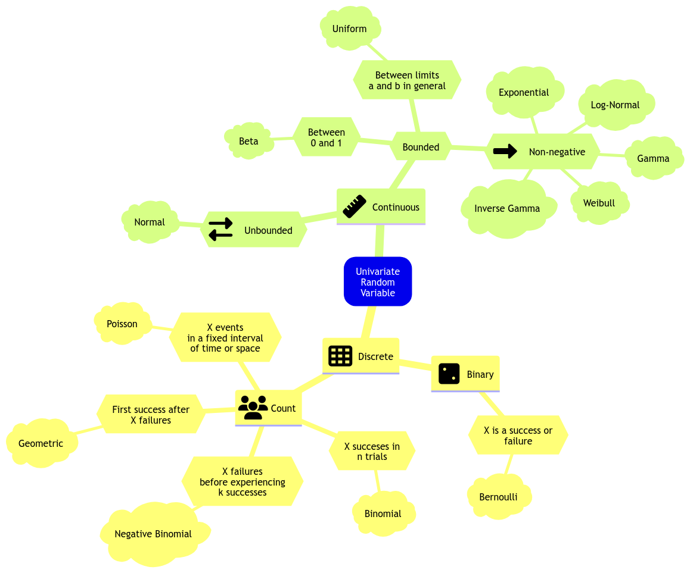

## Bayes' Theorem

Let $\theta$ be a parameter of interest and $Y$ be the observed data.

- **Prior**: $P(\theta)$
  - $P(\theta^c) = 1 - P(\theta)$
- **Likelihood** of the data given the parameter:
  - $\ell(\theta|Y) = P(Y|\theta)$
- **Posterior** (what we want to find): $P(\theta|Y)$

$$P(\theta|Y) = \frac{P(Y|\theta)P(\theta)}{P(Y)}$$

$$\text{posterior} = \frac{\text{prior} \times \text{likelihood}}{\text{normalization constant}}$$

$$\text{posterior} \propto \text{prior} \times \text{likelihood}$$

### Sampling MCMC using rstan

- **Some considerations**:
  - **Warm-up**: Discard the first $n$ samples to allow the chain to converge
  - **Thinning**: Only keep every $n$th sample to reduce autocorrelation
    - skip the first $n$ samples and then keep every $n$th sample

$$\text{Num of approx posterior samples} = \frac{\text{iter} - \text{warmup}}{\text{thin}}$$

## Bayesian Normal Linear Regression

- Comparable to OLS
- Example: We want to consider the effects of `temp_feel` (numeric) and `weekend` (boolean) on `rides` (count).
  - For OLS would use Poisson regression since output is count data.
  - `lm(rides ~ temp_feel + weekend, data = bikeshare)`

$$Y_i \sim \mathcal{N}(\beta_0 + \beta_1X_{i1} + \beta_2X_{i2}, \sigma^2)$$

- $X_{i1}$ is `temp_feel`
- $X_{i2}$ is `weekend`: 1 if weekend, 0 if not
- $\beta_0$ is the intercept ~ $Gamma(7.5, 1)$
- $\beta_1$ is the coefficient for `temp_feel` ~ $\mathcal{N}(0, 1000^2)$
- $\beta_2$ is the coefficient for `weekend` ~ $\mathcal{N}(0, 1000^2)$
- $\sigma^2$ is the variance ~ $IG(0.001, 0.001)$
  - Inverse Gamma distribution (popular for variance priors > 0)

#### MCMC Simulation

- Use `stan` to sample from the posterior distribution.

```r
{r bikerides_stan}

data {
  int<lower=0> n;                               // training sample size
  vector[n] y;                                  // response vector
  vector[n] x_1;                                // regressor 1 vector
  vector[n] x_2;                                // regressor 2 vector
  real pred_x_1;                                // fixed value for regressor 1
  real pred_x_2;                                // fixed value for regressor 2
}

parameters {
  real<lower=0> beta_0;                         // intercept with lower bound
  real beta_1;                                  // regression coefficient 1
  real beta_2;                                  // regression coefficient 2
  real<lower=0> sigma;                          // common standard deviation with lower bound
  }

model {
  beta_0 ~ gamma(7.5, 1);                       // alpha = 7.5 and beta = 1
  beta_1 ~ normal(0, 1000);                     // mu_b1 = 0 and sigma_b1 = 1000
  beta_2 ~ normal(0, 1000);                     // mu_b2 = 0 and sigma_b2 = 1000
  sigma ~ inv_gamma(0.001, 0.001);              // eta = 0.001 and lambda = 0.001
  y ~ normal(beta_0 + beta_1 * x_1 + beta_2 * x_2, sigma);
}
generated quantities {
  real y_pred = normal_rng(beta_0 + beta_1 * pred_x_1 + beta_2 * pred_x_2, sigma);
}
```

- `generated quantities` creates a posterior predictive distribution `y_pred` which takes into account:
  - **Posterior variablility** in the parameters (from joint posterior distribution of the parameters)
  - **Sampling variability** in the data (Each prediction should deviate from its posterior prediction) so add random noise
- It executes after obtaining the posterior samples for the parameters.

Now compile the `Stan` model:

```r
# view the posterior summary
round(summary(posterior_bikeshare)$summary, 2)[-6, c("mean", "sd", "2.5%", "97.5%")]
```

- The 2.5% and 97.5% quantiles are the 95% credible intervals.
  - If the interval **contains 0**, then the coefficient is **not significant**.
  - If the interval is **large**, then the model is **not very certain** about the coefficient (i.e. model is not capturing the right systematic component).
- There is also 2.5% and 97.5% quantiles for the `y_pred` which is the **posterior predictive distribution** for a 95% prediction interval.

## Bayesian Hypothesis Testing

- Using a Tinder example where we want to infer the prob of finding a partner if we use Tinder.
  - $X_i \sim \text{Bernoulli}(\pi)$ for each person $i$
    - $\pi$ is the probability of finding a partner
  - Prior: $\pi \sim \text{Beta}(a, b)$
  - Likelihood: $Y|\pi \sim \text{Binomial}(n, \pi)$
  - Posterior: $\pi|y \sim \text{Beta}(a', b') = \text{Beta}(a+y, b+n-y)$

### One-Sided Hypothesis Testing

- **Claim**: In any city like Vancouver, more than 15% of the single people who use the Tinder app will eventually find a partner.
  - **Null Hypothesis**: $\pi \leq 0.15$
  - **Alternative Hypothesis**: $\pi > 0.15$ (associated with the claim)
- In Bayesian, we use the _posterior_ and **get probability for each hypothesis** (unlike frequentist).
- Use `pbeta` function to get the probability
  - If posterior $Beta(a'=24, b'=192)$ from likelihood of 20 successes out of 200 trials
  - Then $H_0: P(\pi \leq 0.15 | y=20) = \int_0^{0.15} f(\pi | y=20) d\pi$
  - equal to `pbeta(0.15, 24, 192)`
    </br>
- In the Tinder example, we get 2 probabilities:
  - $P(H_0 | y=20) = P(\pi \leq 0.15 | y=20) = 0.957$
  - $P(H_a | y=20) = P(\pi > 0.15 | y=20) = 0.043$
- Can get **Posterior Odds** that $\pi > 0.15$ by dividing the two probabilities.

$$\text{Posterior Odds} = \frac{P(H_a | y=20)}{P(H_0 | y=20)} = \frac{0.043}{0.957} = 0.045$$

- **Interpretation**: $\pi$ is 22 times($\frac{1}{0.045}$) more likely to be less than or equal to 0.15 compared to being greater than 0.15 using our **posterior model**.

### Bayes Factor

- Do the same for **prior odds**

$$\text{Prior Odds} = \frac{P(H_a)}{P(H_0)}$$

$$\text{Bayes Factor} = \frac{\text{Posterior Odds}}{\text{Prior Odds}}$$

- Bayes Factor = 1: Plausibility of $H_a$ stays the same even after new data
- Bayes Factor > 1: Plausibility of $H_a$ increases after new data
- Bayes Factor <br 1: Plausibility of $H_a$ decreases after new data

</br>

- If from MCMC, we cannot get analytical solution for Bayes Factor since no exact PDF to integrate.
- Can use `bayesfactor` package in R to get Bayes Factor.
  - **Solution:** Empirical cumulative distribution function (ECDF) of the posterior samples to approximate the posterior distribution. Use `ecdf` function in R.

### Two-Sided Hypothesis Testing

- Lets say we want to figure out: whether or not 15% of the single people who use the Tinder app will eventually find a partner (in any city like Vancouver)
  - $H_0: \pi = 0.15$
  - $H_a: \pi \neq 0.15$

$$P(\pi = 0.15 | y=20) = \int_{0.15}^{0.15} f(\pi | y=20) d\pi = 0$$

- Does not work since =0, so add a range of values (e.g. $\pm 0.10$)

  - $H_0: \pi \in [0.05, 0.25]$
  - $H_a: \pi \notin [0.05, 0.25]$

- Then find the **credible interval** for the posterior distribution of $\pi$.

```r
qbeta(c(0.025, 0.975), 24, 192)
```

Then based on the results:

- If **credible interval** falls within the range of $H_0$, then we are in favor of $H_0$, with 95% probability.

## Bayesian Binary Logistic Regression

- Comparable to [logistic regression](https://mds.farrandi.com/block_3/561_regression/561_regression#logistic-regression)

### The Likelihood

- Let $Y_i \in \{0, 1\}$
- Likelihood:
  $$Y_i | \beta_0 \beta_1 \sim \text{Bernoulli}(\pi_i) $$

  $$\text{link function}: log(\frac{\pi_i}{1-\pi_i}) = \beta_0 + \beta_1 X_i$$

- Parameter of interest: $\beta_0, \beta_1$
- Let us assume Priors:
  - $\beta_0 \sim N(\mu=0, \sigma^2=100^2)$
  - $\beta_1 \sim N(\mu=0, \sigma^2=100^2)$
- Assume 0 because we do not know if there is any association, also variace is high to reflect the uncertainty.

### Comparing Bayesian vs Frequentist BLR

| Frequentist BLR                                           | Bayesian BLR                                                              |
| --------------------------------------------------------- | ------------------------------------------------------------------------- |
| Estimates the MLE (Maximum Likelihood Estimation)         | Estimates the posterior distribution                                      |
| Estimates the standard errors with `std.error` in `glm()` | Estimates the standard deviation of the posterior distribution wioth `sd` |
| Estimates the confidence intervals                        | Estimates the credible intervals                                          |

- A big advantage of Bayesian: **did not need to derive any Maximum Likelihood steps**
- Meaning of Bayesian coefficients:
  - e.g. estimate of $\beta_1$ is 0.009, 95% credible interval is (0.005, 0.0134), since 0 is not in the posterior credible interval:
  - For each unit increase in income, a subject is 1.009 times more likely to believe in climate change
  - There is a 95% posterior probability that the true value of $\beta_1$ lies between 0.005 and 0.0134

## Complete Pooled Model

- **Complete Pooled Model**: A model that pools all the data together and estimates a single parameter for all the data
- e.g. have a dataset of multiple rocket types and their launchs, and want to estimate the probability of a rocket launch succeeding

  - Only 1 $\pi$ for all the rocket types

$$
\text{likelihood:} \qquad X_i|\pi \sim \text{Binomial}(n_i, \pi) \quad \text{for } i = 1, \dots, 367\\
\text{prior:} \qquad \pi \sim \text{Beta}(a = 1, b = 1).
$$

- Does not allow us to infer any probability of an individual group

## Non-pooled Model

- **Non-pooled Model**: A model that estimates a parameter for each group of data
- e.g. have a dataset of multiple rocket types and their launchs, and want to estimate the probability of a rocket launch succeeding
  - Have a $\pi_i$ for each rocket type

$$
\text{likelihood:} \qquad X_i|\pi_i \sim \text{Binomial}(n_i, \pi_i) \quad \text{for } i = 1, \dots, 367\\
\text{prior:} \qquad \pi_i \sim \text{Beta}(a = 1, b = 1).
$$

- Better when comparing groups with different sample sizes
  - Using MLE will not be reliable when sample sizes are small
  - e.g. Binomial distribution with $n=1$
- **Drawbacks**:
  - Cannot generalize to new groups
  - Cannot take valuable information from other groups

## Hierarchical Bayesian Model

- **Hierarchical Bayesian Model**: A model that estimates a parameter for each group of data, but also estimates a distribution of parameters for all the groups
- **Key feature**: Nesting of parameters over multiple levels
  - Common to have a variable in the model prior is itself a random variable (needs another prior)
    - Or a variable in the likelihood is itself a random variable (needs another prior)
- e.g. have a dataset of multiple rocket types and their launchs, and want to estimate the probability of a rocket launch succeeding
  - Have a $\pi_i$ for each rocket type
  - Also have random variables $\pi_i \sim \text{Beta}(a, b)$
    - $a$ and $b$ are parameters and no longer hyperparameters
    - new hyperparameters are the priors for $a$ and $b$

$$
\text{likelihood:} \qquad X_i|\pi_i \sim \text{Binomial}(n_i, \pi_i) \quad \text{for } i = 1, \dots, 367\\
\text{priors:} \qquad \pi_i \sim \text{Beta}(a, b) \\
\quad a \sim \text{Gamma}(0.001, 0.001) \\
\qquad b \sim \text{Gamma}(0.001, 0.001).
$$

- e.g2 dataset of number of freethrows made and attempts by a Basketball player for multiple seasons

  - Good because can predict free throw percentage for a new season
  - Have a $n_i$ as number of attempts that season and $\pi_i$ is free throw percentage for that season

  $$
  \text{likelihood:} \qquad X_i|\pi_i \sim \text{Binomial}(n_i, \pi_i) \quad \text{where i=season number}\\
  \text{prior:} \qquad \pi_i \sim \text{Beta}(a,b) \\
  \quad a \sim \text{Gamma}(0.001, 0.001) \\
  \qquad b \sim \text{Gamma}(0.001, 0.001).
  $$

- Basically **combines the best** of of the complete pooled model and the non-pooled model:
  - Use valuable info from all groups to infer the success probability of a specific group
  - Can get posterior predictive distribution for new group

### Why will the estimates be more precise?

- Using Heirarchical Bayesian, we will get narrower Credible Intervals compared to the non-pooled model
- **Borrowing Strength**: The estimates will be more precise because we are using information from all the groups
  - In the case of rockets, its the $a$ and $b$ that are being shared
  - In the case of basketball, its the $a$ and $b$ that are being shared (Same person more likely to have similar free throw percentage in different seasons)
- Helps learn parameters and reduce posterior variance

### Get Success for all Groups

- Use posterior means of $a$ and $b$ to get the posterior means of $\pi_i$ for all groups (in rocket example)

### Prediction for New Group

- In Stan, need to add a new block `generated quantities` to get the posterior predictive distribution for a new group

```stan
generated quantities {
  real<lower=0,upper=1> pi_pred = beta_rng(a, b);
}
```

- This generates a new $\pi$ for a new group from the posterior distribution of $a$ and $b$
- Mean of `pi_pred` (new group) is similar to the posterior mean of $\pi$ for all groups
  - because it is the best bayesian model we can obtain without further covariates/ features
